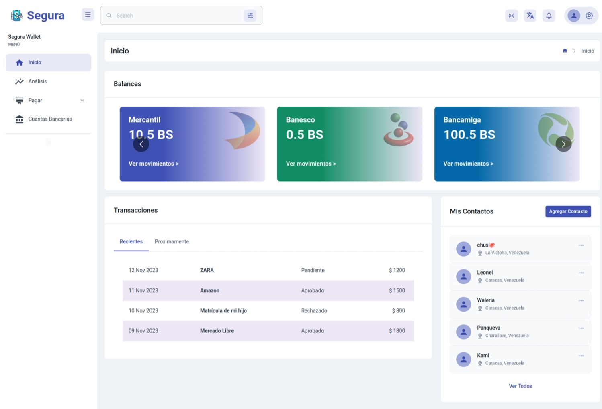
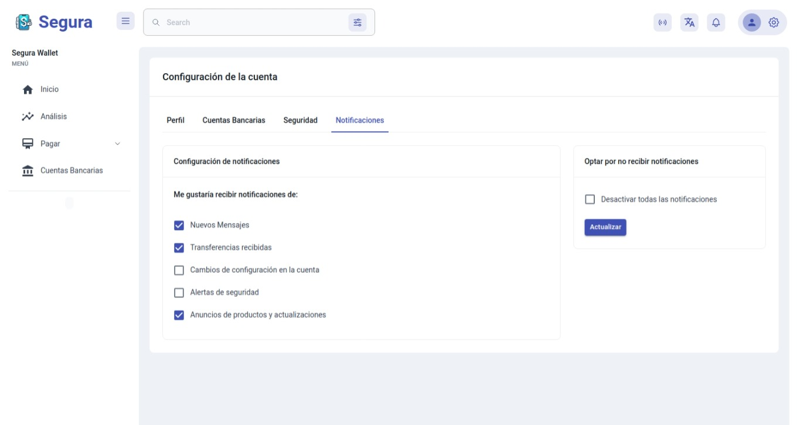
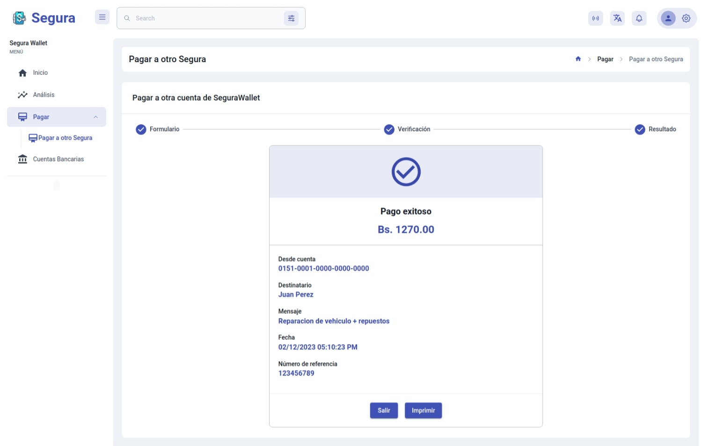
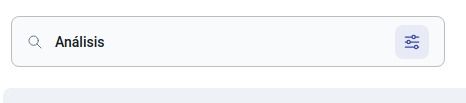

# Segura Wallet

Segura Wallet es un producto de e-Banking que busca ayudar a las personas a tener un mejor control de sus finanzas personales, a la vez que provee a sus usuarios con facilidades nunca antes vistas para manejar todos sus productos financieros en un solo lugar.

Con lo común que es hoy en día tener más de una cuenta bancaria en distintas instituciones financieras, resulta muy fácil:

- Perder el control de los gastos y de los ingresos.
- Contar con distintas aplicaciones para manejar cada cuenta, cada una con su propia interfaz, reglas, usabilidad, etc.

Por ello, las caracterías principales de Segura Wallet son:

- **Un solo lugar para manejar todas tus cuentas:** Segura Wallet te permite sincronizae todas tus cuentas bancarias en la aplicación, con lo que podrás no solo ver el estado de todas tus cuentas en un solo vistazo, sino que también podrás realizar transferencias entre tus cuentas, a cuentas de otros usuarios de Segura, o a otras cuentas bancarias, sin importar si son de distintas instituciones financieras.
- **Control de gastos:** Segura Wallet te permite categorizar tus gastos, para que puedas ver en qué estás gastando tu dinero, y así puedas tomar mejores decisiones financieras.
- **Análisis de balances:** Con la revolución de la Inteligencia Artifical, Segura Wallet te ofrece análisis detallados de tus balances, con gráficas y estadísticas que te ayudarán a entender de manera fácil y rápida cómo estás manejando tus finanzas personales, como también obtendrás recomendaciones personalizadas y pronósticos de tus finanzas, con lo que planear tu futuro financiero será más fácil que nunca.

## Descripción del proyecto

Para el prototipado de este proyecto, se desarrolló una aplicación web utilizando el framework de React.js, con el framework de Next.js para el manejo de rutas y el renderizado del lado del servidor, y Material UI para el diseño de la interfaz de usuario.

Para correr el proyecto, se debe clonar el repositorio, instalar las dependencias con `npm install`, y ejecutar un servidor local con el comando `npm run dev`. Luego, puedes abrir [http://localhost:3000](http://localhost:3000) en tu navegador para ver el resultado.

## Vistas de Segura Wallet

<table>
    <thead>
        <tr>
            <th>Característica</th>
            <th>Imagen</th>
        </tr>
    </thead>
    <tbody>
        <tr>
            <td>Inicio de sesión</td>
            <td rowspan="2"></td>
        </tr>
        <tr>
            <td><a href="#">/login</a></td>
        </tr>
        <tr>
            <td>Registro</td>
            <td rowspan="2"></td>
        </tr>
        <tr>
            <td><a href="#">/register</a></td>
        </tr>
        <tr>
            <td>Recuperar contraseña</td>
            <td rowspan="2"></td>
        </tr>
        <tr>
            <td><a href="#">/forgot</a></td>
        </tr>
        <tr>
            <td>Inicio</td>
            <td rowspan="2"></td>
        </tr>
        <tr>
            <td><a href="#">/home</a></td>
        </tr>
        <tr>
            <td>Perfil</td>
            <td rowspan="2">
            Perfil:   
            Cuentas bancarias:   
            Seguridad:   
            Notificaciones:   
            </td>
        </tr>
        <tr>
            <td><a href="#">/profile</a></td>
        </tr>
        <tr>
            <td>Análisis</td>
            <td rowspan="2">
            </td>
        </tr>
        <tr>
            <td><a href="#">/analysis</a></td>
        </tr>
        <tr>
            <td>Pagar</td>
            <td rowspan="2">
            </td>
        </tr>
        <tr>
            <td><a href="#">/pay</a></td>
        </tr>
        <tr>
            <td>Pagar a una otra cuenta de Segura Wallet</td>
            <td rowspan="2">
            Proceso: 
             
            Éxito: 
             </td>
        </tr>
        <tr>
            <td><a href="#">/pay/segura</a></td>
        </tr>
        <tr>
            <td>Cuentas bancarias</td>
            <td rowspan="2">
            </td>
        </tr>
        <tr>
            <td><a href="#">/accounts</a></td>
        </tr>
        <tr>
            <td>Generalidades de la interfaz</td>
            <td rowspan="2">
            Barra de búsqueda: 
             
            Acerca de: 
             
            Idioma:  
              
            Notificaciones: 
             
            Configuración de la cuenta: 
            
            </td>
        </tr>
        <tr>
            <td><a href="#">Todas las rutas</a></td>
        </tr>
    </tbody>
</table>
